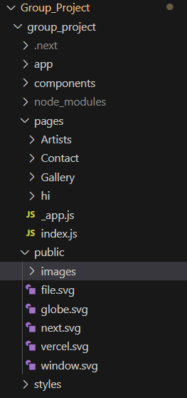
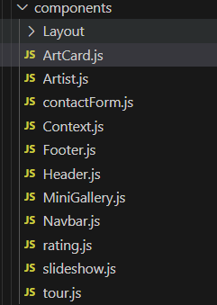
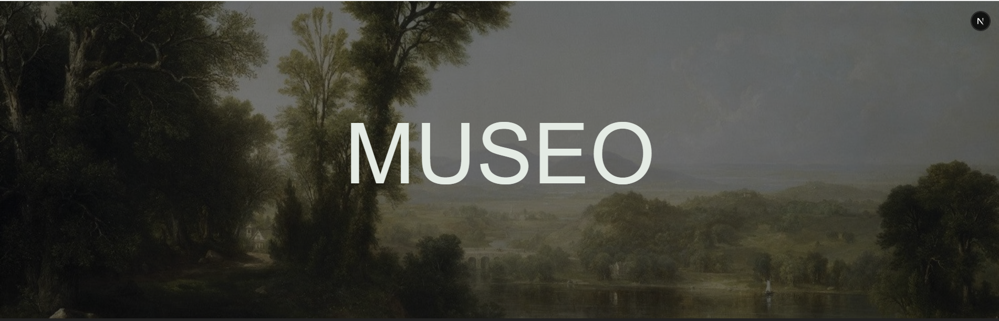
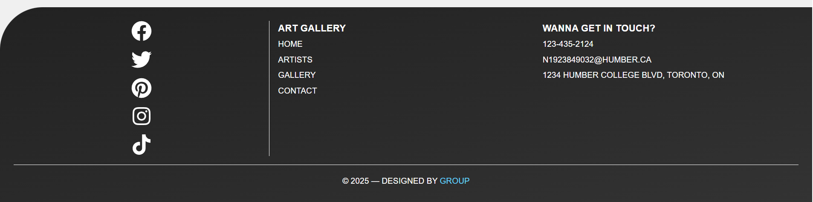
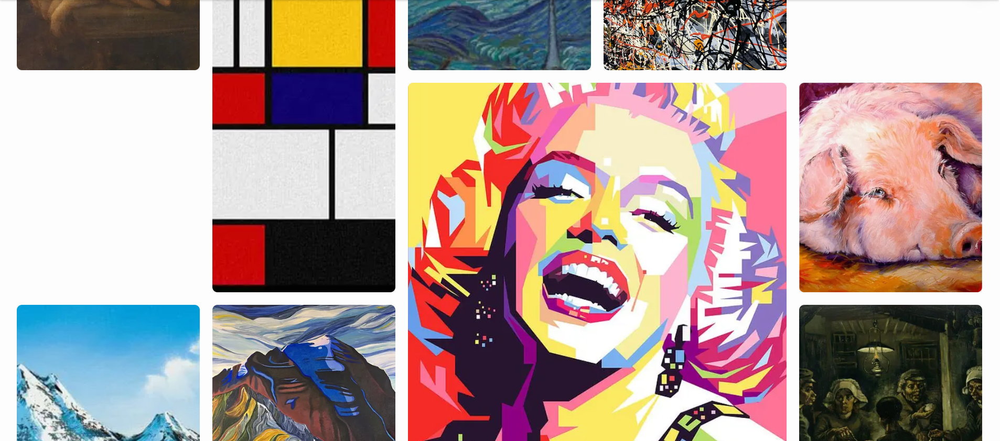
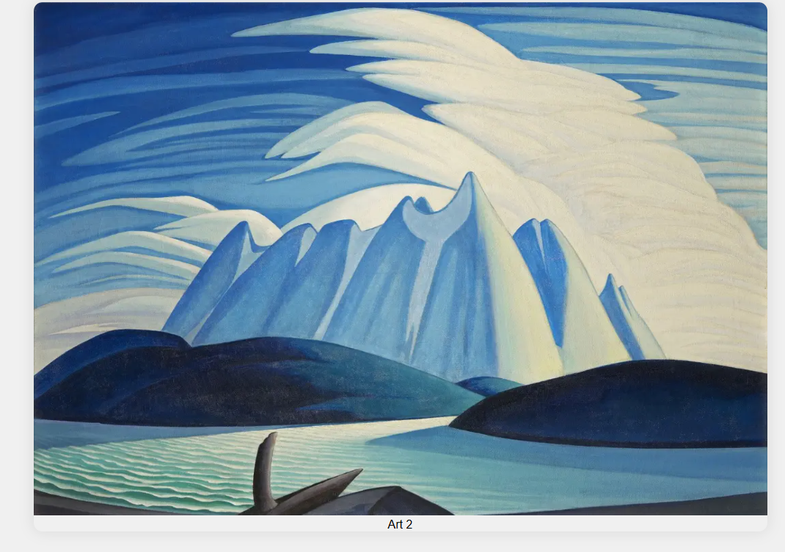
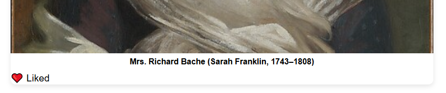
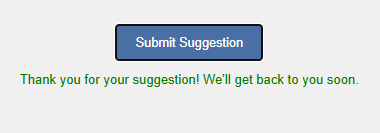
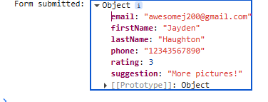

!! YOU MUST USE npm install react-icons TO VIEW FOOTER ICONS. !!
-- Roles --
- **Jayden**: Project setup, lazy loading,  routing, Navbar.js ArtCard.js rating.js
- **Alex**: Page structure, dynamic routing, presentation slides Layout.js, Header.js, Footer.js
- **Khuwailid**: State management, interactivity, data flow slideshow.js, MinGallery.js, tour.js
- **Emmanuel**: Styling, responsive layout, contactForm.js, Context.js. image optimization.

Majority of Work was done locally making things easier for Emmanuel and Khuwailid, main components and so on. any other small issues could be debugged if anything else happened later or just communicated through slack before big changes.

 -- A modern art gallery web app built with Next.js. It features a responsive layout, image slideshow, interactive like/favorite system using localStorage, and artwork fetched from the Metropolitan Museum of Art API. --

 -- FEATURES --

- Mini art gallery displaying different types of art from different types of artist.
- Responsive grid layout.
- Slideshow of featured pieces.
- Click to expand artwork in a modal.
- Like/favorite functionality stored with localStorage.
- Dynamic routing for different artist, uniquely catered to each one featuring a like button to the artist.
- Contact page with suggestion, feedback and rating feature that submits and saves to console.

-- DEMO --

Zoomed in feature.

-- FOLDER STRUCTURE --

-- COMPONENTS -- 

-- Header: Contains the site navigation and logo.

-- Footer: - Contains social media links and copyright information.

-- MiniGallery: Displays a grid of artwork images.

-- Slideshow: Displays a slideshow of featured artwork.

-- Modal: Displays a larger version of the artwork when clicked.

-- LikeButton: Handles the like/favorite functionality for each   artwork.

-- ContactForm: Handles user feedback and suggestions.

-- Navbar: Alternating between the different sites:
