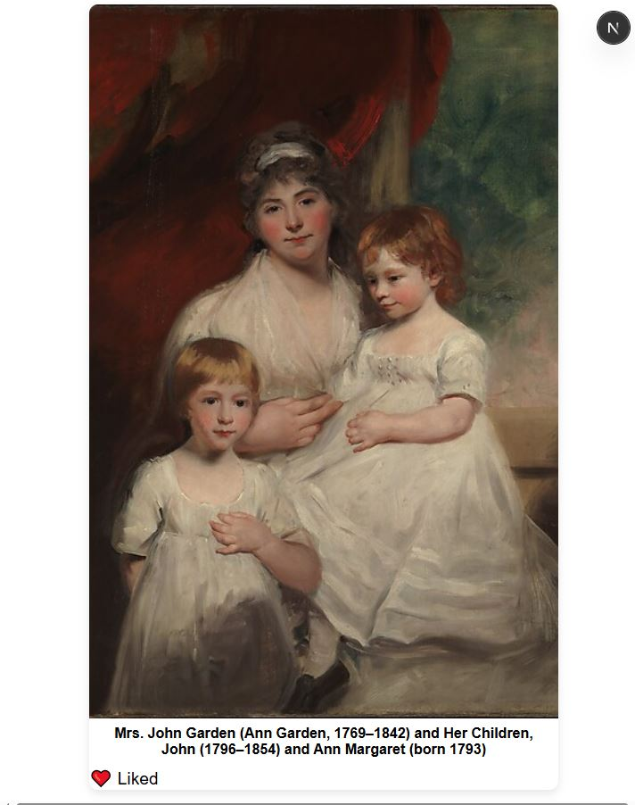
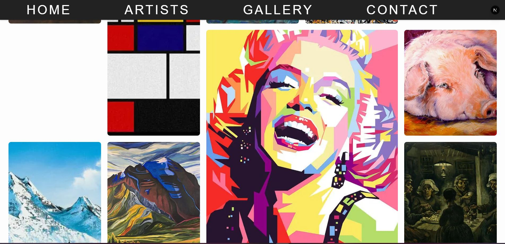
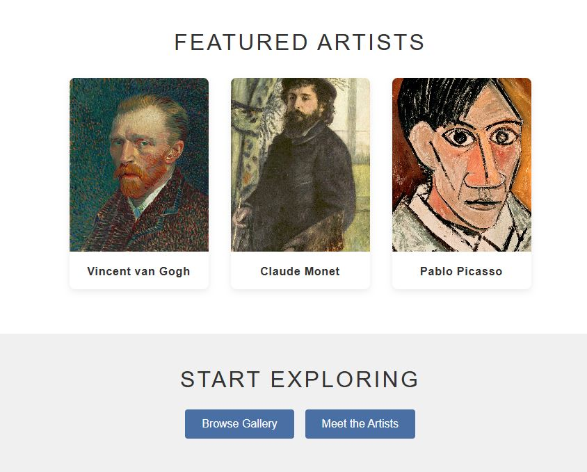
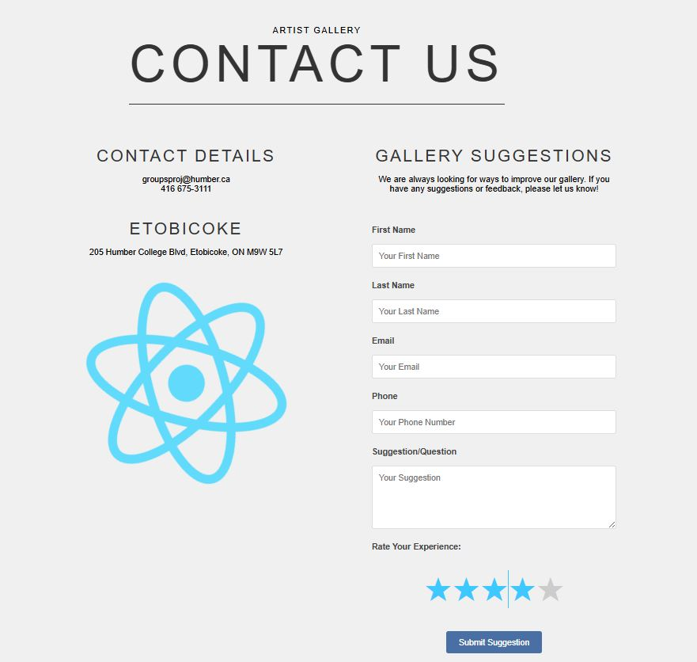
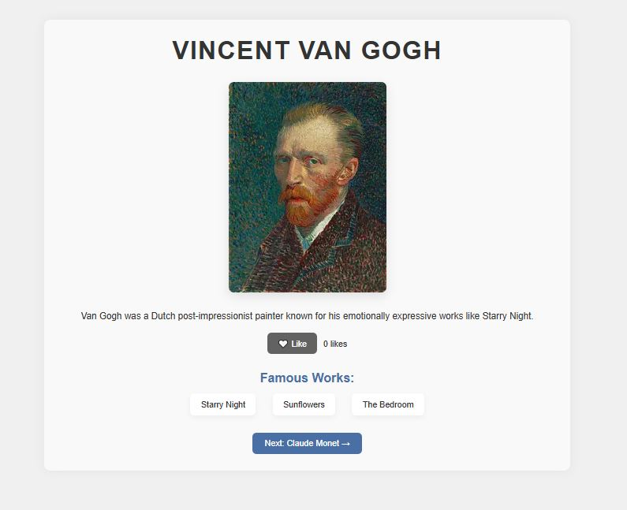
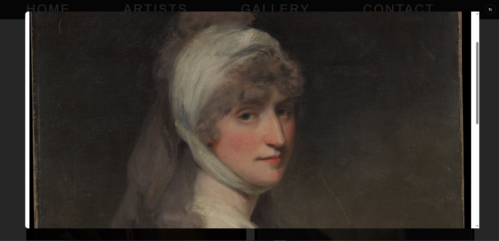

!! YOU MUST USE npm install react-icons TO VIEW FOOTER ICONS. !!

 -- A modern art gallery web app built with Next.js. It features a responsive layout, image slideshow, interactive like/favorite system using localStorage, and artwork fetched from the Metropolitan Museum of Art API. --

 -- FEATURES --

- Mini art gallery displaying different types of art from different types of artist.
- Responsive grid layout.
- Slideshow of featured pieces.
- Click to expand artwork in a modal.
- Like/favorite functionality stored with localStorage.
- Dynamic routing for different artist, uniquely catered to each one featuring a like button to the artist.
- Contact page with suggestion, feedback and rating feature that submits and saves to console.

-- DEMO --

Zoomed in feature.
